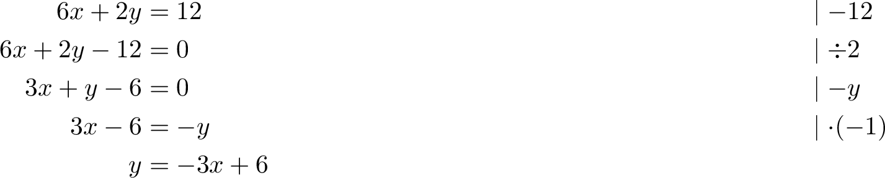
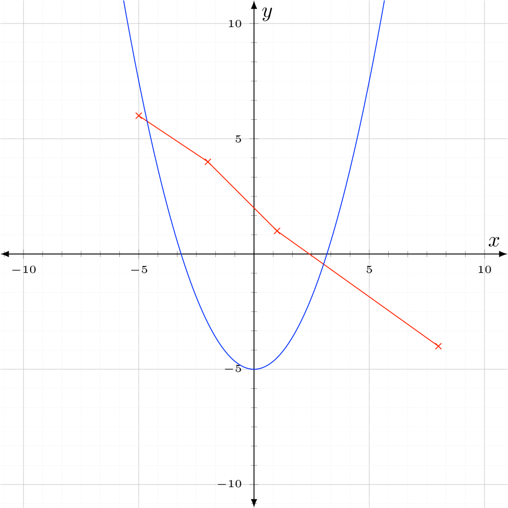

# LaTeX Vorlagen

Benutzerdefinierte LaTeX-Vorlagen für Mathematik- und Physik-LK

## Lineare Gleichungssystem

Vorlage für das Erstellen von linearen Gleichungssystemen mit Platz für Termumformumgen mit Notizstrichen an der Seite.
```tex
\documentclass[preview]{standalone}

\usepackage{amsmath}

\usepackage{icomma}	% kein Leerschritt nach dem Komma in Mathemodus
\setlength\parindent{0pt} % Kein automatischer Indent bei einem neuen Par.

\begin{document}

\begin{flalign*}
	\frac{x}{2} + \frac{y}{6} &= 1  && \lvert \; {\cdot 2}, \; {\cdot 6}\\
	6x+2y &= 12 && \lvert \; {-12}\\
	6x+2y-12 &= 0 && \lvert \; \div 2\\
	3x+y-6 &= 0 && \lvert \; {-y}\\
	3x-6 &=-y && \lvert \; {\cdot (-1)}\\
	y &= -3x+6
\end{flalign*}

\end{document}
```

## Koordinatensystem

Einfaches Koordinatensystem mit hellgrauem Gitter. Beispiele für Funktionen und Punktplots sind eingefügt. 

```tex
\documentclass{standalone}
\usepackage{tikz}
\usepackage{pgfplots}
\pgfplotsset{compat=default}

\begin{document}
\begin{tikzpicture}
\begin{axis}[
	width=10cm,height=10cm,
	% WINDOW
    xmin=-11, xmax=11,
    ymin=-11, ymax=11,
    xlabel=$x$,ylabel=$y$,
    xlabel style={at={(ticklabel* cs:.975, 3)},anchor=north},
    ylabel style={at={(ticklabel* cs:.975, -3)},anchor=west},
    enlargelimits={abs=0.5},
    % GRID
    grid=both,
    grid style={line width=.1pt, draw=gray!10},
    major grid style={line width=.2pt,draw=gray!50},
    axis lines=middle,
    minor tick num=5,
    axis line style={latex-latex},
    ticklabel style={font=\tiny},
]
	\addplot[
		color=red,
		mark=x
	] coordinates {
		(-5,6)
		(-2,4)
		(1,1)
		(8,-4)
	};
	
	\addplot[
		color=blue,
		domain=-10:10,
		samples=100,
		smooth]
	{.5*x^2-5};
\end{axis}
\end{tikzpicture}
\end{document}
```
